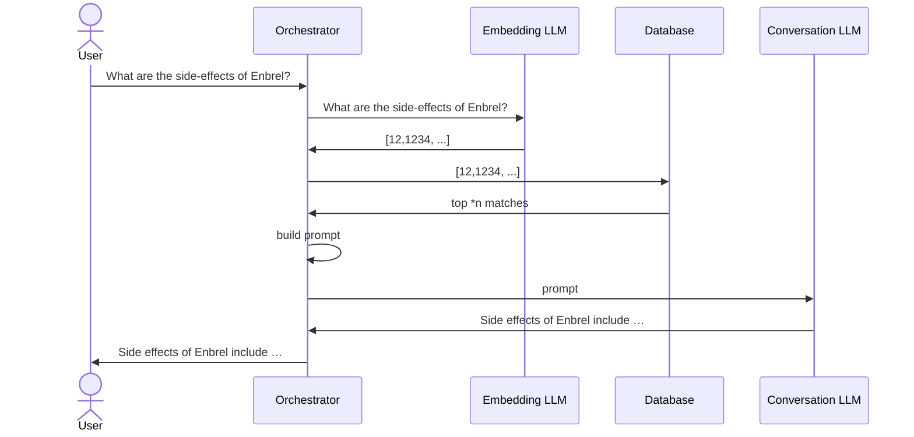

I recently had the privilege of delivering my first talk at an international conference, a milestone I'm excited to have shared in [this post](https://roosma.dev/p/virtual-hideaway-international-talk/). The experience was exhilarating, and I'm pleased to report it went well. In this blog, I'll recount the journey I shared during my talk—how to set up a Retrieval Augmented Generation (RAG) system for your projects.

## Why Retrieval Augmented Generation (RAG)?

In the rapidly evolving landscape of Generative AI, a foundational concept has emerged: Retrieval Augmented Generation (RAG). Detailed in [Microsoft's overview](https://learn.microsoft.com/en-us/azure/search/retrieval-augmented-generation-overview), RAG enhances the creative process by leveraging a vast dataset—much more extensive than what can be directly incorporated into a prompt.

RAG's importance cannot be overstated as it addresses several limitations inherent to Large Language Models (LLMs):

- **Cost Efficiency**: The most advanced GPT-4 model can process up to 128,000 [tokens](https://platform.openai.com/tokenizer), equivalent to about 100,000 words. Despite appearing ample, this often proves insufficient in practice and incurs a steep cost of $1.28 per request, at $0.01 per 1,000 tokens.

- **Answer Verification**: Just as recalling specific details from long-ago learned material is challenging without citing exact sources, LLMs face a similar issue. They generate answers based on their training data but cannot specify the source of their information, making verification difficult.

- **Availability of Information**: The state-of-the-art `gpt-4-0125-preview` model's training data extends only up to December 2023. Thus, it lacks any information published after this date. This gap means it cannot provide insights on recent developments, such as a new product line. Furthermore, when data confidentiality is a priority, and information isn't publicly accessible, traditional models like GPT-4 offer no assistance.

RAG offers a compelling solution by maintaining information in a searchable database rather than embedding all new or missing details directly into the prompt. Upon receiving a query, the system fetches a relevant information subset to formulate an answer. This method is not just more economical; it also supports source verification, thereby mitigating the dissemination of inaccurate information through a technique known as [grounding](https://everything.intellectronica.net/p/grounding-llms). Additionally, RAG reduces the need for [fine-tuning](https://platform.openai.com/docs/guides/fine-tuning) and altogether avoids the need for model retraining to incorporate new information.

One can see RAG in action through platforms like [Azure AI Search](https://azure.microsoft.com/en-us/products/ai-services/ai-search/), which employs RAG to sift through uploaded data, utilizing Azure's AI capabilities to furnish pertinent outcomes.

## Approaches to RAG

In this article, we'll focus on using [embeddings](https://openai.com/blog/introducing-text-and-code-embeddings) for the retrieval component of RAG. If you're not yet familiar with the concept, I recommend spending about 10 minutes reading through the provided link—it's quite insightful. Using embeddings should address most of the scenarios you might encounter in real-world applications, making it a well-established method for implementing RAG.

However, the field of Generative AI, particularly RAG, is rapidly evolving, drawing interest from brilliant minds worldwide. As a result, numerous innovative approaches to RAG are emerging. For instance, some are exploring SQL-based retrieval methods, while others are experimenting with agent-based techniques. Despite these advancements, we'll start with embeddings to build a solid foundation in understanding RAG's basics.

## Ingestion Process

At the heart of an effective RAG setup lies the Extract, Transform, Load (ETL) pipeline, a fundamental component that, while common across many data handling systems, requires specific attention to detail in this context. The following diagram illustrates the comprehensive journey data undertakes from its initial form, through its extraction and transformation phases, to its ultimate persistence within the system.


### Input to Extract


The "Input to Extract" phase involves converting diverse data types into text, preparing them for use in model prompts. This step serves as the foundation for generating model responses. As input sources diversify, selecting the appropriate method for text conversion becomes a key consideration in designing the ingestion pipeline.

Extracting text from [Microsoft Word Documents](https://nl.wikipedia.org/wiki/Microsoft_Word) can be efficiently managed using libraries such as [python-docx](https://python-docx.readthedocs.io/en/latest/) for Python or [DocX](https://github.com/xceedsoftware/docx) for C#. PDF files are well handled by tools like [PyMuPDF](https://pymupdf.readthedocs.io/en/latest/) or services such as [Azure AI Document Intelligence](https://learn.microsoft.com/en-us/azure/ai-services/document-intelligence/overview?view=doc-intel-4.0.0), which offer streamlined text extraction capabilities.

Advancements in Machine Learning have broadened the scope of input sources for RAG systems. Models like [Whisper](https://openai.com/research/whisper) enable the transcription of speech from audio files, while [DALL-E](https://openai.com/dall-e-2) can interpret or extract text from images, extending the range of usable inputs from traditional documents to multimedia content.

The choice of extraction method depends heavily on the type of input. A precise extraction process is fundamental to achieving better results in the later stages of RAG. By tailoring the ingestion pipeline to handle different inputs effectively, we lay a solid foundation for generating accurate and relevant responses through the model.

### Extract to Partition

After the extraction process, the next step is partitioning the extracted data into smaller, more manageable pieces. This step is vital because Retrieval Augmented Generation (RAG) aims to tackle the challenge of managing vast amounts of input data, which is not only difficult for a conversational Large Language Model (LLM) to process but also costly.


The partitioning approach can vary significantly based on the type of input. For example, a PDF document could be divided into chapters, pages, paragraphs, or sentences based on its structure. If the document includes an index, partitioning could also be done based on topics. For inputs like invoices, partitioning might occur at the line item level.

The objective with partitioning is to create segments that are as small as possible without losing the context necessary to understand the information they contain. A useful guideline for determining the appropriate size of a partition is to randomly select a partition and review it. If the context of the information is unclear, the partition may be too small. Conversely, if the partition contains multiple subjects, it might be too large.

Dedicating time to refine the partitioning process is crucial. The effectiveness of the RAG system, including the relevance and accuracy of the answers generated by the model, as well as the system's speed and cost-efficiency, significantly depends on the quality and size of the data partitions created during this step.

This approach ensures that the partitioning stage is optimized to produce manageable chunks of data that retain enough context to be useful, while also keeping processing requirements and costs in check.

### Partition to Transform

The "Partition to Transform" phase in your RAG implementation journey is where the data starts to take on a new form—transforming partitions into embeddings for efficient retrieval.


With the data now partitioned into manageable chunks, the next step is to convert these partitions into embeddings. This conversion is crucial for facilitating swift and precise data retrieval later on. The selection of the embedding model is a critical decision at this stage. As a starting point, the model `text-embedding-ada-002` from OpenAI is highly recommended due to its widespread use and proven effectiveness. However, OpenAI has also introduced two newer models, `text-embedding-3-small` and `text-embedding-3-large`, which may offer advantages in certain scenarios.

When choosing an embedding model, factors such as cost and processing speed are important to consider, especially given the frequency with which you'll be using this model. Consistency is key; the same model used for creating embeddings must be used during the retrieval phase to ensure compatibility. If you decide to switch models at any point, be prepared to re-transform all your partitions to maintain system integrity.

For most use cases, any of the three mentioned models will suffice. Nevertheless, it's worth noting that if your source data is particularly unique or specialized, selecting a model specifically trained on similar data types could yield better results.

Executing the transform step is straightforward: process each partition through the selected model to generate embeddings. This step is foundational, setting the stage for the efficient retrieval and utilization of the data in your RAG system.

### Transform to Persist

The final stage in the ingestion pipeline involves securing the fruits of your labor by persisting the transformed data. This step is crucial for ensuring that the embeddings, which are now ready for retrieval and use in RAG processes, are stored safely and efficiently.


Persisting the embeddings typically involves using a database that supports a vector data type. Both [PostgreSQL](https://www.postgresql.org) and [Redis](https://redis.com/) have proven to be reliable choices for this purpose, offering robust support for vector data. However, the landscape of suitable databases is broad, with many capable of handling vector types. SAAS offerings like [Azure Cosmos DB](https://azure.microsoft.com/en-us/services/cosmos-db/) also provide scalable, managed solutions for storing embeddings.

For those at the beginning of their RAG implementation journey, PostgreSQL is a highly recommended starting point. It's not only free and open-source but also well-supported, making it a solid choice for initial experiments and smaller-scale projects. As your needs evolve, especially when scaling up, the choice of database becomes more critical. For those operating within cloud environments, considering a SAAS option might be advantageous, offering seamless integration and managed services that can simplify operations.

In essence, while the choice of database should be informed by your current scale and future growth expectations, starting with PostgreSQL can provide a strong foundation. As the database ecosystem continues to evolve, with vector data types becoming more ubiquitous, transitioning or scaling your data storage solution to meet the demands of your RAG system will become an easier process.

## Ingestion Code Example

You can find all the source code I mention in this article on this [GitHub repository](https://github.com/droosma/generative-ai-hello-world). While it's not ready for production, it offers a solid foundation for your projects.

The full code these snippets are taken from can be found [here](https://github.com/droosma/generative-ai-hello-world/blob/main/OpenAi/Ingest/IngestionUseCase.cs)

```csharp
var stream = await fileSystem.Load("enbrel-epar-product-information_en.pdf");
```

For the onstage demonstration, I chose to work with a single, extensive PDF document: the product information for a medicine named Enbrel. This document stretches over 350 pages, presenting a formidable challenge for anyone to read through due to its complexity and length. It serves as a good example to showcase the capabilities of large language models (LLMs) in making dense and critical information accessible to all. In this code, the document is loaded directly from the file system for simplicity. However, in practical applications, such data would typically be fetched from cloud-based storage solutions, like blob storage, to handle scalability and accessibility in real-world scenarios.

```csharp
var operation = await documentAnalysisClient.AnalyzeDocumentAsync(WaitUntil.Completed, "prebuilt-read", stream);
```

In my next step, I leveraged the Azure AI Document Intelligence to extract text from a PDF. This tool is impressively powerful, allowing users to even train their own models for specific extraction needs. However, for this demonstration, I opted for the prebuilt-read model.

```csharp
var lines = operation.Value.Pages.SelectMany(page => page.Lines.Select((line, index) 
        => (line.Content, page.PageNumber, LineNumber:index + 1))).ToList();
const int PartitionSize = 100;
const int OverlapSize = 5;

var numberOfPartitions = (int) Math.Ceiling((lines.Count - OverlapSize) / (double) (PartitionSize - OverlapSize));

var partitions = Enumerable.Range(0, numberOfPartitions)
                           .Select(index =>
                                   {
                                       ... //create partition from lines ...
                                       return Partition.From(partitionLines);
                                    }).ToList();
```

After extracting text with Azure AI Document Intelligence, I transformed the result into a list of lines, noting each line's page and line number. I then segmented these lines into partitions of 100, with a 5-line overlap to maintain context from the original source. While this approach may not always be the best, it proved sufficient for demonstration purposes, albeit with higher costs and slower processing times.

```csharp
var embeddingTasks = partitions.Select(async partition =>
    await _retryPolicy.ExecuteAsync(async () =>
            {
                var options = new EmbeddingsOptions("text-embedding-ada-002", new List<string> {partition.EmbeddingContent});
                var result = await openAiClient.GetEmbeddingsAsync(options);
                return Embedding.From(partition, result.Value.Data[0].Embedding);
            }));
var embeddings = await Task.WhenAll(embeddingTasks);
```

I proceeded to convert the partitions into embeddings using OpenAI's `text-embedding-ada-002` model. Admittedly, the setup was less than ideal. Processing each partition individually led to frequent rate limiting issues, which I mitigated using a retry policy. There are more efficient methods for requesting embeddings, especially when dealing with multiple partitions.

Finally, I stored all generated embeddings in my database.

```csharp
await database.Save(embeddings);
```

With a database brimming with embeddings, we can now look into the retrieval phase of the Retrieval-Augmented Generation (RAG).

## Retrieval Process

The retrieval component of the RAG system is notably more streamlined compared to the ingestion phase. Ingestion involves intricate processing, including the accommodation of diverse input sources and the application of various partitioning strategies. In contrast, retrieval efficiently utilizes the groundwork established during ingestion, specifically leveraging a vector-supported database to facilitate the process.


Typically, interactions with a conversational Large Language Model (LLM) involve a user posing a question and the LLM generating a response based on its trained patterns, which is then relayed back to the user. These models synthesize answers from their vast datasets, though they don't "know" in the human sense. For more insights into this, [this discussion](https://stackoverflow.blog/2023/07/03/do-large-language-models-know-what-they-are-talking-about/) offers a deep dive.

Integrating RAG modifies this interaction significantly:



Although this process may appear to involve numerous steps, it operates seamlessly. An Orchestrator plays a pivotal role in this streamlined workflow, performing several key functions:

1. It receives the query from the user.
2. It generates embeddings based on the query, utilizing the same model from the ingestion phase.
3. It queries the database with these embeddings to identify the top *n* matches, where `n` can be adapted to suit specific needs (for example, `n=10` in this setup).
4. It assembles a comprehensive prompt that integrates the retrieved database matches, the original user query, and includes directives for grounding and verification. This enriched prompt is then forwarded to the conversational LLM, setting the stage for generating a response that is not only relevant but also anchored in verified information.
5. Finally, it delivers the generated response back to the user, closing the loop.

This approach not only ensures that the model's responses are informed by up-to-date and relevant data but also enhances the user's experience by providing precise and verified information.

## Retrieval Code Example

Given the complexity and the need for a streamlined demonstration, the code for the retrieval component of the RAG system is distributed across multiple parts of the project rather than confined to a single file. Below is an integral piece of the system, encapsulated within the [`ConversationWithReferences`](https://github.com/droosma/generative-ai-hello-world/blob/main/OpenAi.Web/ConversationWithReferences.cs) class:

```csharp
public class ConversationWithReferences(QuestionContextUseCase useCase,
                                        OpenAIClient openAiClient)
{
    private const string _systemMessage = 
    $"""
        - Role: Helpful Documentation Assistant
        - Purpose: Assist consumers with questions specifically about documentation.
        - Method: Answer using only the context provided within `{QuestionContextUseCase.ContextMarker}`.
        - Context Details:
            - Contains relevance-ordered matches with an associated reference index.
        - Limitations:
            - If the answer isn't in the context, clearly state inability to answer.
        - Note:
            - No need for content warnings in messages; users are pre-informed about reliability.
            - Focus solely on answering the question.
        - Response:
            - Include the reference index using square brackets immediately after the relevant information sourced from that reference.
            - Explicitly include line breaks as `\n` within the "Answer" field to preserve the paragraph structure fo the original text.
            - output strictly as a valid JSON object as follows:
            - "Answer": "<your answer with inline citations and explicit line breaks (\n) to preserve formatting>,
            - "References": <json array of used reference indexes>
            - Do not include any content outside this JSON structure.
    """;

    public async Task AskQuestion(string question)
    {
        var (prompt, references) = await useCase.Execute(question);
        ....
    }
}
```

The `ConversationWithReferences` class encapsulates the dialogue between a user and the conversational LLM, structured around a specific use case represented by `QuestionContextUseCase`. This class is pivotal for managing and directing the flow of conversation within the constraints of provided documentation or context.

A standout feature of this implementation is the `_systemMessage`, a comprehensive template that establishes the ground rules for the conversation. This message serves multiple purposes:

- It defines the role and purpose of the assistant, emphasizing its function as a documentation helper.
- It sets the methodological framework, instructing the assistant to rely exclusively on the context marked by `{QuestionContextUseCase.ContextMarker}`.
- It outlines the limitations and expectations for the interaction, such as handling questions beyond the context's scope and formatting responses.

The `AskQuestion` method is at the heart of the interaction, leveraging [`QuestionContextUseCase.Execute(question)`](https://github.com/droosma/generative-ai-hello-world/blob/main/OpenAi/question/QuestionContextUseCase.cs) to generate a tailored prompt and associated references. This approach ensures that the LLM's responses are grounded in the provided context, aligning with the system message's directives for answer generation and reference citation.

```csharp
public async Task<(string, Reference[])> Execute(string question)
{
    // Generate embeddings for the given question using a specific model.
    var questionEmbeddingResult = await openAiClient.GetEmbeddingsAsync(new EmbeddingsOptions("text-embedding-ada-002",
                                                                                              new List<string> {question}));
    var questionEmbedding = questionEmbeddingResult.Value.Data[0].Embedding;

    // Query the database for the top 10 matches based on the question's embedding.
    var questionMatches = await database.Find(questionEmbedding, 10);
    var matches = questionMatches.ToArray();

    // Build the prompt with matches and references.
    var promptBuilder = new StringBuilder();
    promptBuilder.AppendLine(ContextMarker);

    for (var i = 0; i < matches.Length; i++)
    {
        promptBuilder.AppendLine($"MATCH: {matches[i].Content.Optimize()}");
        promptBuilder.AppendLine($"REF: {i}");
    }

    promptBuilder.AppendLine(ContextMarker);

    // Optimize and return the constructed prompt along with the references.
    return (promptBuilder.ToString().Optimize(), matches.Select(m => m.Reference).ToArray());
}

```

The `Execute` method in the `QuestionContextUseCase` class starts by using the OpenAI client to turn a user's question into an embedding with the `text-embedding-ada-002` model—the same code as used in the ingestion process. This transforms the question into the embedding's format that can then be compared against stored embeddings to find matches.

Following this, the method queries the database to fetch the top ten entries that closely match the question's embedding. The rationale here is simple: to gather a set of potentially relevant answers based on the question's context.

With the matches in hand, the method then constructs a prompt. It lists out each match and assigns a reference index to each, aiming to keep track of where each piece of information originated. This part of the process is fairly utilitarian, ensuring that the information is organized in a way that a conversational LLM can use to generate answers.

The method concludes by returning a string that combines all these elements in a structured format, alongside an array of references to the matches. This output is prepared with the intention of making it easier for the conversational LLM to utilize the provided context in its response generation.

```csharp
public class ConversationWithReferences(QuestionContextUseCase useCase,
                                        OpenAIClient openAiClient)
{
    public async Task AskQuestion(string question)
    {
        ....
        _chatMessages.Add(new ChatMessage("User", prompt));
        _chatMessages.Add(new ChatMessage("User", question));

        Response<ChatCompletions> response = await openAiClient.GetChatCompletionsAsync(ChatCompletionsOptions());
        var responseMessage = response.Value.Choices[0].Message;

        var answer = JsonSerializer.Deserialize<Response>(responseMessage.Content)!;

        var filteredReferences = answer.References
                                       .Where(index => index < references.Length)
                                       .ToDictionary(index => index, index => references[index]);
        
        _chatMessages.Add(new ChatMessage("Assistant", answer.Answer, filteredReferences));
    }
}
```

The `AskQuestion` method in the `ConversationWithReferences` class plays a key role in interacting with the user and the LLM. After receiving the user's question and constructing the appropriate prompt, this method proceeds by logging both the prompt and the original question into the chat history. This historical record is essential for maintaining the flow of conversation and providing context for the LLM's response.

Following this, the method communicates with the LLM via the `openAiClient.GetChatCompletionsAsync` function, passing in the chat history as context for generating an answer. The LLM's response is then parsed to extract the answer along with any references used in its formation. This step is crucial for providing verifiable sources for the information given in the LLM's response, enhancing the credibility and usefulness of the generated answer.

By filtering these references based on their presence in the list of references obtained earlier, the method ensures that only relevant and valid references are associated with the assistant's response. This filtered list of references is then added to the chat history alongside the assistant's answer, allowing users to explore the context and sources of the information provided.

This approach not only facilitates a dynamic and informative interaction between the user and the assistant but also underscores the importance of transparency and verifiability in automated responses. Through this process, the `ConversationWithReferences` class embodies the essence of a RAG implementation, where answers are not only generated based on contextually relevant information but are also anchored by references that users can verify.

## Closing thoughts

As we wrap up our exploration of Retrieval Augmented Generation (RAG) systems, it's clear that the journey from understanding the foundational concepts to applying them in real-world scenarios is both exciting and complex. Utilizing tools like the [OpenAI SDK NuGet package](https://www.nuget.org/packages/Azure.AI.OpenAI/) provides a great starting point for developers venturing into the world of RAG. However, for those looking to elevate their projects to a production level, considering advanced solutions like [Semantic Kernel](https://learn.microsoft.com/en-us/semantic-kernel/overview/) can offer more sophisticated frameworks that streamline the development process and enhance the system's robustness.

The power of RAG, combined with Large Language Models (LLMs), offers unprecedented opportunities to enrich applications with dynamic and contextually relevant content. Yet, with great power comes great responsibility. Ensuring the accuracy of the generated content and providing users with the means to verify this information is crucially important. One innovative approach to bolstering the trustworthiness of LLM outputs is incorporating a verification layer within the system's architecture. By employing a secondary LLM to validate the primary LLM's responses, developers can add an additional layer of credibility to the system, fostering a more reliable and user-centric experience.

As we continue to push the boundaries of what's possible with AI and machine learning, let's remain vigilant about the ethical implications and strive to build systems that not only answer users' queries but also promote transparency and trust. The future of RAG systems is not just in how advanced or sophisticated they can become, but in how they can serve as a reliable bridge between vast stores of knowledge and the everyday information needs of users around the globe.

Remember, the journey doesn't end here. The field of RAG and conversational AI is rapidly evolving, and staying informed about the latest developments and best practices will be key to leveraging these technologies effectively. Here's to creating more informed, accessible, and trustworthy digital experiences for all.
