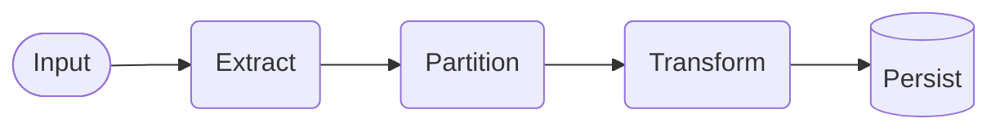
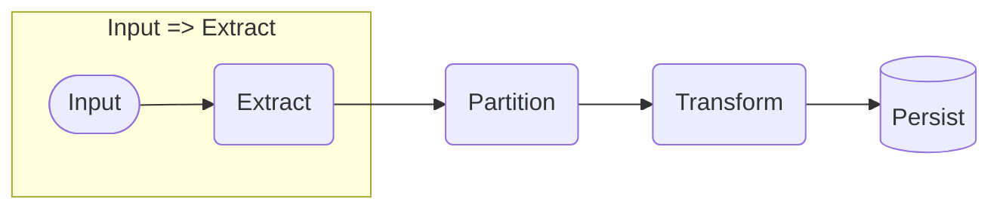
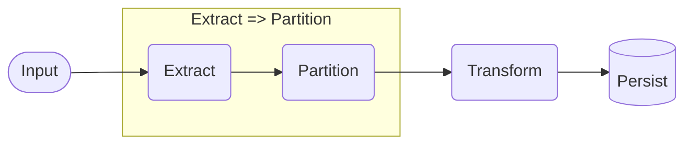
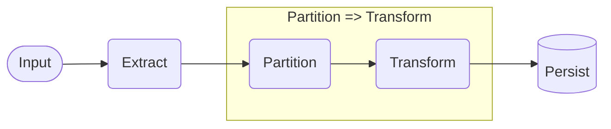
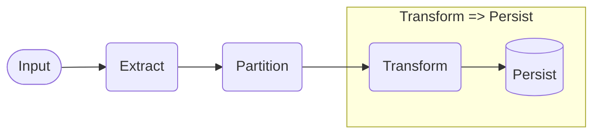
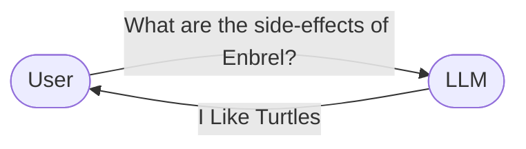
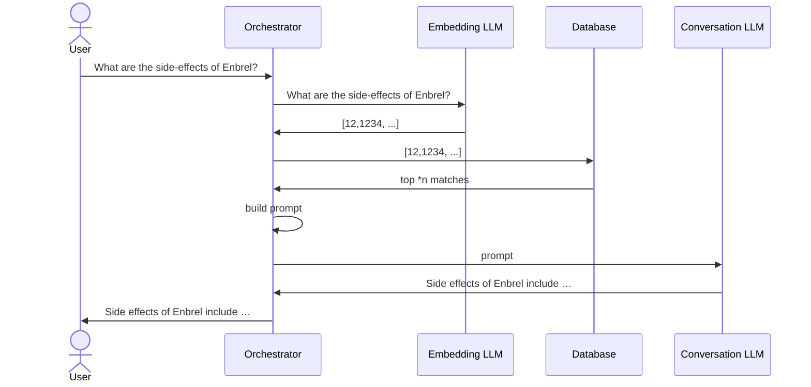

I recently gave my first talk at an international conference, as mentioned in [this post](https://roosma.dev/p/virtual-hideaway-international-talk/). It was an exciting experience, and I'm pleased to share it went well. In this blog, I'll tell the story I shared during that talk.

These days, Generative AI is becoming very common. A basic concept in this field is [Retrieval Augmented Generation (RAG)](https://learn.microsoft.com/en-us/azure/search/retrieval-augmented-generation-overview), which involves using relevant information to enhance the creation process. Essentially, it uses a large set of data, far more than what could typically be included directly in a prompt.

As of now, the most advanced version of the GPT-4 model can handle 128,000 [tokens](https://platform.openai.com/tokenizer), which equates to about 100,000 words. While this might seem like a lot, it's actually not that much in practice and can be quite expensive, costing \$1.28 for each request at a rate of \$0.01 per 1,000 tokens.

Rather than attempting to cram all information into one prompt, the idea is to store information in a database that can be searched and filtered. This way, when someone asks a question, the system retrieves a subset of relevant information to use in a special prompt for generating the answer. This method is not just cost-effective; it also makes it easier to [ground](https://everything.intellectronica.net/p/grounding-llms) the base model with updated information without needing to [fine-tuning](https://platform.openai.com/docs/guides/fine-tuning) it frequently.

You might have seen RAG in action through services like [Azure AI Search](https://azure.microsoft.com/en-us/products/ai-services/ai-search/), which allows you to upload your data and then applies RAG behind the scenes. It searches and filters through the data as needed, utilizing Azure's AI capabilities to provide relevant results.

In my talk, I focused on "How to set up a RAG system for your own projects?" At its core, a basic RAG setup requires an Extract, Transform, Load (ETL) pipeline, which brings its own challenges. To simplify, I'll break down the ETL pipeline into two main parts: [Ingestion](#ingestion) and [Retrieval](#retrieval).

Let's get started.

## Approaches to RAG

In this article, we'll focus on using [embeddings](https://openai.com/blog/introducing-text-and-code-embeddings) for the retrieval component of RAG. If you're not yet familiar with the concept, I recommend spending about 10 minutes reading through the provided link—it's quite insightful. Using embeddings should address most of the scenarios you might encounter in real-world applications, making it a well-established method for implementing RAG.

However, the field of Generative AI, particularly RAG, is rapidly evolving, drawing interest from brilliant minds worldwide. As a result, numerous innovative approaches to RAG are emerging. For instance, some are exploring SQL-based retrieval methods, while others are experimenting with agent-based techniques. Despite these advancements, we'll start with embeddings to build a solid foundation in understanding RAG's basics.

## <span id="ingestion">Ingestion</span>

The process of ingesting data for RAG involves several detailed steps:



This diagram shows the flow from initial input through extraction, partitioning, transformation, and finally, persistence in the system.

### Input to Extract



In the initial phase of converting various data types into text, the "Input to Extract" step is pivotal. This conversion is critical because the text will be used in prompts for the model to generate answers. As the variety of input sources has expanded significantly, the method for converting these sources into text becomes crucial, affecting the design of the ingestion pipeline.

For instance, when dealing with [Microsoft Word Documents](https://nl.wikipedia.org/wiki/Microsoft_Word), libraries like [python-docx](https://python-docx.readthedocs.io/en/latest/) for Python or [DocX](https://github.com/xceedsoftware/docx) for C# are effective for extracting text. Similarly, PDF files can be processed using tools such as [PyMuPDF](https://pymupdf.readthedocs.io/en/latest/) or services like [Azure AI Document Intelligence](https://learn.microsoft.com/en-us/azure/ai-services/document-intelligence/overview?view=doc-intel-4.0.0), which help in extracting text efficiently.

Moreover, the advancements in Machine Learning have opened new doors for text extraction. Models like [Whisper](https://openai.com/research/whisper) can transcribe speech from audio files, and [DALL-E](https://openai.com/dall-e-2) can describe or extract text from images. This broadens the scope of input sources that can be utilized for RAG, from traditional text documents to multimedia content.

The choice of extraction method depends heavily on the type of input. A precise extraction process is fundamental to achieving better results in the later stages of RAG. By tailoring the ingestion pipeline to handle different inputs effectively, we lay a solid foundation for generating accurate and relevant responses through the model.

### Extract to Partition

After the extraction process, the next crucial step is partitioning the extracted data into smaller, more manageable pieces. This step is vital because Retrieval Augmented Generation (RAG) aims to tackle the challenge of managing vast amounts of input data, which is not only difficult for a conversational Large Language Model (LLM) to process but also costly.



The partitioning approach can vary significantly based on the type of input. For example, a PDF document could be divided into chapters, pages, paragraphs, or sentences based on its structure. If the document includes an index, partitioning could also be done based on topics. For inputs like invoices, partitioning might occur at the line item level.

The objective with partitioning is to create segments that are as small as possible without losing the context necessary to understand the information they contain. A useful guideline for determining the appropriate size of a partition is to randomly select a partition and review it. If the context of the information is unclear, the partition may be too small. Conversely, if the partition contains multiple subjects, it might be too large.

Dedicating time to refine the partitioning process is crucial. The effectiveness of the RAG system, including the relevance and accuracy of the answers generated by the model, as well as the system's speed and cost-efficiency, significantly depends on the quality and size of the data partitions created during this step.

This approach ensures that the partitioning stage is optimized to produce manageable chunks of data that retain enough context to be useful, while also keeping processing requirements and costs in check.

### Partition to Transform

The "Partition to Transform" phase in your RAG implementation journey is where the data starts to take on a new form—transforming partitions into embeddings for efficient retrieval.



With the data now partitioned into manageable chunks, the next step is to convert these partitions into embeddings. This conversion is crucial for facilitating swift and precise data retrieval later on. The selection of the embedding model is a critical decision at this stage. As a starting point, the model `text-embedding-ada-002` from OpenAI is highly recommended due to its widespread use and proven effectiveness. However, OpenAI has also introduced two newer models, `text-embedding-3-small` and `text-embedding-3-large`, which may offer advantages in certain scenarios.

When choosing an embedding model, factors such as cost and processing speed are important to consider, especially given the frequency with which you'll be using this model. Consistency is key; the same model used for creating embeddings must be used during the retrieval phase to ensure compatibility. If you decide to switch models at any point, be prepared to re-transform all your partitions to maintain system integrity.

For most use cases, any of the three mentioned models will suffice. Nevertheless, it's worth noting that if your source data is particularly unique or specialized, selecting a model specifically trained on similar data types could yield better results.

Executing the transform step is straightforward: process each partition through the selected model to generate embeddings. This step is foundational, setting the stage for the efficient retrieval and utilization of the data in your RAG system.

### Transform to Persist

The final stage in the ingestion pipeline involves securing the fruits of your labor by persisting the transformed data. This step is crucial for ensuring that the embeddings, which are now ready for retrieval and use in RAG processes, are stored safely and efficiently.



Persisting the embeddings typically involves using a database that supports a vector data type. Both [PostgreSQL](https://www.postgresql.org) and [Redis](https://redis.com/) have proven to be reliable choices for this purpose, offering robust support for vector data. However, the landscape of suitable databases is broad, with many capable of handling vector types. SAAS offerings like [Azure Cosmos DB](https://azure.microsoft.com/en-us/services/cosmos-db/) also provide scalable, managed solutions for storing embeddings.

For those at the beginning of their RAG implementation journey, PostgreSQL is a highly recommended starting point. It's not only free and open-source but also well-supported, making it a solid choice for initial experiments and smaller-scale projects. As your needs evolve, especially when scaling up, the choice of database becomes more critical. For those operating within cloud environments, considering a SAAS option might be advantageous, offering seamless integration and managed services that can simplify operations.

In essence, while the choice of database should be informed by your current scale and future growth expectations, starting with PostgreSQL can provide a strong foundation. As the database ecosystem continues to evolve, with vector data types becoming more ubiquitous, transitioning or scaling your data storage solution to meet the demands of your RAG system will become an easier process.

## Ingestion Code Example

All the source code I use here can be found on my [GitHub](https://github.com/droosma/generative-ai-hello-world) it's not production code, but it should provide a good starting point for your own implementation.

The ingestion code can be found [here](https://github.com/droosma/generative-ai-hello-world/blob/main/OpenAi/Ingest/IngestionUseCase.cs)

```csharp
var stream = await fileSystem.Load("enbrel-epar-product-information_en.pdf");
```

As this was intended as an onstage demo, I used a single PDF document as the input source. The document was a product information document for a medicine called Enbrel. A truly tedious document of about 350 pages long that doesn't fit in a single prompt, it's pretty much unreadable for normal mortals, so it really shows off the power behind LLMs and how the can make important information like this available for everyone. For demonstration purposes I just load it from my file system, but in a real world scenario you would probably load it from a blob storage.

```csharp
var operation = await documentAnalysisClient.AnalyzeDocumentAsync(WaitUntil.Completed, "prebuilt-read", stream);
```

Next I used the Azure AI Document Intelligence to extract the text from the PDF. This is a very powerful tool, that even allows you to train your own models for extraction. But for this demo I used the `prebuilt-read` model.

```csharp
var lines = operation.Value.Pages.SelectMany(page => page.Lines.Select((line, index) 
        => (line.Content, page.PageNumber, LineNumber:index + 1))).ToList();
const int PartitionSize = 100;
const int OverlapSize = 5;

var numberOfPartitions = (int) Math.Ceiling((lines.Count - OverlapSize) / (double) (PartitionSize - OverlapSize));

var partitions = Enumerable.Range(0, numberOfPartitions)
                           .Select(index =>
                                   {
                                       ... //create partition from lines ...
                                       return Partition.From(partitionLines);
                                    }).ToList();
```

Given the extracted text I get back from the Azure AI Document Intelligence, I just flatten the result into a list of lines, recording the page number and line number for each line. Next I create partitions of 100 lines, with a 5 line overlap to retain a little more context and meta data of the partition in the original source. As I described in my Partition step, this is not the way to go most of the time, but for demonstration purposes it got the answers I needed, but at a very high cost and slow process times.

```csharp
var embeddingTasks = partitions.Select(async partition =>
    await _retryPolicy.ExecuteAsync(async () =>
            {
                var options = new EmbeddingsOptions("text-embedding-ada-002", new List<string> {partition.EmbeddingContent});
                var result = await openAiClient.GetEmbeddingsAsync(options);
                return Embedding.From(partition, result.Value.Data[0].Embedding);
            }));
var embeddings = await Task.WhenAll(embeddingTasks);
```

Next I transform the partitions into embeddings using the `text-embedding-ada-002` model from OpenAI. Given the badly architected way I set this up I just loop though all the partitions and individually request an embedding, when doing so I often ran in to rate limiting so I just wrap the calls in a retry policy to handle that. There are also more efficient ways of making the embedding request as multiple partitions are possible.

And finally I dump all my newly generated embeddings into my database.

```csharp
await database.Save(embeddings);
```

Now that we have a database full of embeddings, we can move on to the retrieval part of the RAG.

## <span id="retrieval">Retrieval</span>

Fortunately, the retrieval part of the RAG is a lot more straight forward than the ingestion part. Where we had to account for the different input sources and the different ways to partition the input, the retrieval part is just a matter of caching in on that hard work. And putting our vector supported database to work.



The normal interaction with a conversational LLM is that a user asks a question, the LLM then generates an answer that is then sent back to the user.

In this case the LLM is going to generate the answer the best it can given it's own integrated "knowledge", an LLM doesn't really have knowledge, but it get's the point across see [here](https://stackoverflow.blog/2023/07/03/do-large-language-models-know-what-they-are-talking-about/) for more in-depth discussion. If the answer to your question is part of the public knowledge, the LLM will probably be able to generate a good answer. The main problem we are running into now with the use of LLMs is that when the answer is generated like this, there is no way for us to verify that the answer is factually correct, not without extensively researching it ourselves, given that we are trying to use LLMs to democratize the access to knowledge we want to offer the consumer of the answer targeted sources to verify the answer. As I mentioned earlier, using RAG we can easily ground the LLM in our own knowledge base and prevent ungrounded answers.

There is the ongoing issue of the fact that the information you want to expose to your consumers has been generated just yesterday, say the launch of a new product line, this information is not yet part of training data that the latest LLM has been trained on. Or the information is not and never will be part of the public knowledge. In these cases the LLM will not be able to use it's internal "knowledge" to generate a usable answer.

So how does this interaction change when we use RAG?



Looks like a lot of steps, but it's quite straight forward. We introduce an Orchestrator, a system responsible for coordinating the flow. The three things this system does are:

1. Receives the user's question.
2. Create embeddings from the user's question using the same model as used in the ingestion pipeline.
3. Uses the embeddings to query the database for the top n best matches, I'm using `n=10` in my implementation, but you can use any number that best fits your use case.
4. Builds a prompt that includes the text of the database matches and the user's original question, and sends it off to the conversation LLM
5. Sends the answer back to the user.

## Retrieval Code Example

Given the fact that I had to create a clean looking demo, the code for this part is a little more spread out than I would like, so I can't link you to a single file, but I'm going to walk you through it here, and you will be able to find it with the other source code.

```csharp
public class ConversationWithReferences(QuestionContextUseCase useCase,
                                        OpenAIClient openAiClient)
{
    private const string _systemMessage = 
    $"""
        - Role: Helpful Documentation Assistant
        - Purpose: Assist consumers with questions specifically about documentation.
        - Method: Answer using only the context provided within `{QuestionContextUseCase.ContextMarker}`.
        - Context Details:
            - Contains relevance-ordered matches with an associated reference index.
        - Limitations:
            - If the answer isn't in the context, clearly state inability to answer.
        - Note:
            - No need for content warnings in messages; users are pre-informed about reliability.
            - Focus solely on answering the question.
        - Response:
            - Include the reference index using square brackets immediately after the relevant information sourced from that reference.
            - Explicitly include line breaks as `\n` within the "Answer" field to preserve the paragraph structure fo the original text.
            - output strictly as a valid JSON object as follows:
            - "Answer": "<your answer with inline citations and explicit line breaks (\n) to preserve formatting>,
            - "References": <json array of used reference indexes>
            - Do not include any content outside this JSON structure.
    """;

    public async Task AskQuestion(string question)
    {
        var (prompt, references) = await useCase.Execute(question);
        ....
    }
}
```

To represent a conversation with the user I created a class `ConversationWithReferences`. On that class I keep track of the messages that have been exchanged between the user and the conversation LLM though `_chatMessages`. In this conversation I start with a system message that explains the context of the conversation to the user. This little bit of text is all the grounding we need to make sure the conversation LLM only uses the context we provide to generate the answer and not it's own internal "knowledge". Getting the system message right is important, and it's a good idea to spend some time on it. The other thing this class does is handle the user's question though the `AskQuestion` method. In this method I use the `QuestionContextUseCase` to get the prompt and references.

```csharp
public async Task<(string, Reference[])> Execute(string question)
{
    var questionEmbeddingResult = await openAiClient.GetEmbeddingsAsync(new EmbeddingsOptions("text-embedding-ada-002",
                                                                                              new List<string> {question}));
    var questionEmbedding = questionEmbeddingResult.Value.Data[0].Embedding;

    var questionMatches = await database.Find(questionEmbedding, 10);
    var matches = questionMatches.ToArray();

    var promptBuilder = new StringBuilder();
    promptBuilder.AppendLine(ContextMarker);

    for(var i = 0;i < matches.Length;i++)
    {
        promptBuilder.AppendLine($"MATCH: {matches[i].Content.Optimize()}");
        promptBuilder.AppendLine($"REF: {i}");
    }

    promptBuilder.AppendLine(ContextMarker);

    return (promptBuilder.ToString().Optimize(),
            matches.Select(m => m.Reference).ToArray());
}
```

There you see the `QuestionContextUseCase.Execute` method that is called from the `ConversationWithReferences.AskQuestion` method. The eagle eyed among you might notice that it starts with a familiar piece of code, the `GetEmbeddingsAsync` method from the ingestion pipeline. Once we have the embeddings for the question, we use them to query the database for the top 10 matches. We then use the matches to build a prompt, this prompt includes the original text along with a reference to the partition it came from. We then return the prompt and used the references.

```csharp
public class ConversationWithReferences(QuestionContextUseCase useCase,
                                        OpenAIClient openAiClient)
{
    public async Task AskQuestion(string question)
    {
        ....
        _chatMessages.Add(new ChatMessage("User", prompt));
        _chatMessages.Add(new ChatMessage("User", question));

        Response<ChatCompletions> response = await openAiClient.GetChatCompletionsAsync(ChatCompletionsOptions());
        var responseMessage = response.Value.Choices[0].Message;

        var answer = JsonSerializer.Deserialize<Response>(responseMessage.Content)!;

        var filteredReferences = answer.References
                                       .Where(index => index < references.Length)
                                       .ToDictionary(index => index, index => references[index]);
        
        _chatMessages.Add(new ChatMessage("Assistant", answer.Answer, filteredReferences));
    }
}
```

Back to the `ConversationWithReferences.AskQuestion` method. Once we have the result from the use case, we add the prompt and the question to the chat history. We then send the history to the LLM to get the answer. Once we have the answer we parse it to get the used references so that we can point the user to the relevant information used to generate the answer, and provide the context in a separate view.

And that's the basics of a RAG implementation with verifiable answers.

## Closing thoughts

I hope this post has given you a good understanding of the basics of RAG. In the example code I have only been using the basic [OpenAI SDK NuGet package](https://www.nuget.org/packages/Azure.AI.OpenAI/). If you are going to be implementing a system like this in a production system, I would recommend using something like [Semantic Kernel](https://learn.microsoft.com/en-us/semantic-kernel/overview/) as this incorporates more production ready abstractions and has a lot of the boilerplate code already written for you. But once you get the concept of RAG and how to use it, other frameworks and libraries will be a lot easier to understand.

It has been said before, and I'm going to say it again. The LLM is not responsible for what it generates, that's on us. We need to make sure that the information we expose to the consumer is factually correct, and that we provide the consumer with the tools and incentive to verify the information. An extra step I would recommend is to have an extra step in the orchestration, one that takes the answer generated by the LLM and the context provided to it, and asks another conversational LLM to verify the answer it got from the first LLM. If the second LLM can't verify the answer, you start the process over again. If it can, you can send the user the answer.
